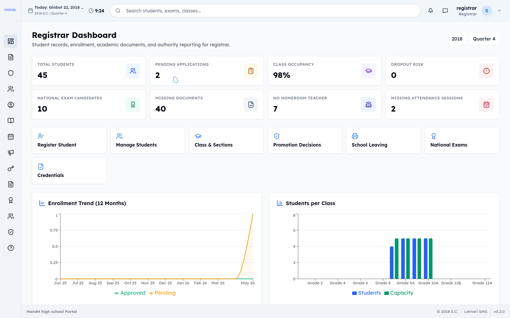
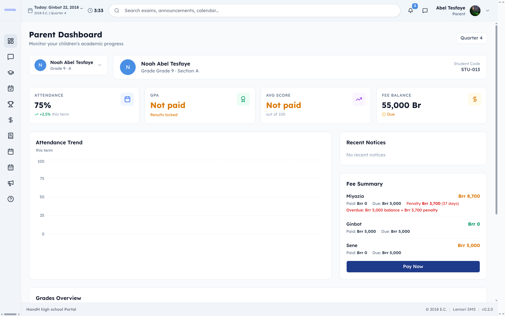
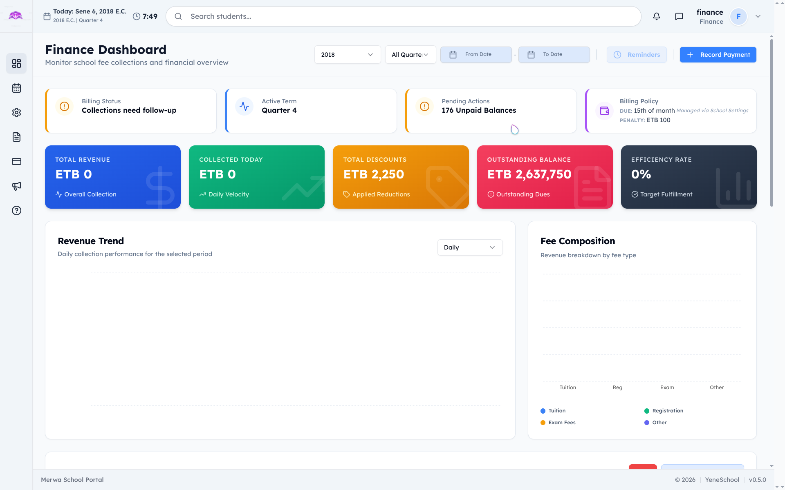
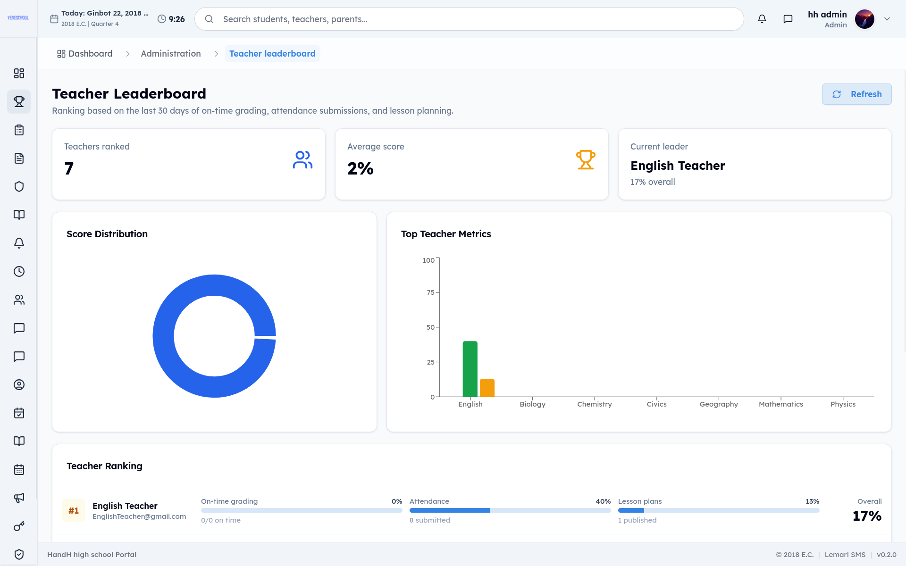
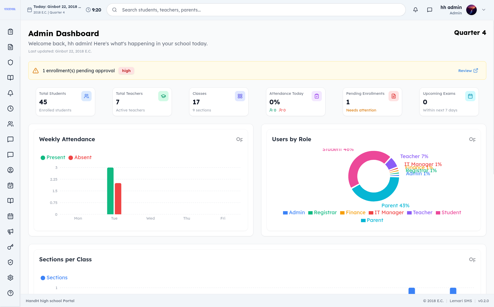

  <h1 style="margin-top:0.5em;">YeneSchool — School Board Proposal / የትምህርት ቦርድ የውሳኔ ሐሳብ ማሳሰቢያ</h1>
  
<strong>Prepared for: [School Name]</strong> / <strong>የተዘጋጀው ለ: [የትምህርት ቤቱ ስም]</strong>

---

## Executive Summary / ማጠቃለያ

Every term, your school generates fees it never collects, sends report cards days late, and answers the same 50 parent phone calls — while a competitor school down the road is doing all of this automatically. This proposal shows exactly how to close that gap in 5 weeks.

በየወረዳው/በየሰሚስተሩ ትምህርት ቤትዎ ሊሰበሰብ የሚገባውን ገቢ ሳያገኝ ይቀራል፣ የውጤት ካርዶችን ያዘገያል፣ እንዲሁም ከተመሳሳይ ወላጆች ለሚነሱ ተደጋጋሚ ጥሪዎች ምላሽ በመስጠት ጊዜ ያጠፋል፤ በአቅራቢያዎ የሚገኝ ተፎካካሪ ትምህርት ቤት ግን ይህንን ሁሉ በራስ-ሰር (automatically) እያከናወነ ይገኛል። ይህ የውሳኔ ሐሳብ ይህንን ክፍተት በ5 ሳምንታት ውስጥ እንዴት ሙሉ በሙሉ መዝጋት እንደሚቻል ያሳያል።

> Pilot program currently underway with 6 schools in Addis Ababa — reference available on request.
> የሙከራ ትግበራው በአሁኑ ወቅት በአዲስ አበባ ውስጥ ከ6 ትምህርት ቤቶች ጋር በመካሄድ ላይ ይገኛል — ማጣቀሻ በጥያቄ ማቅረብ ይቻላል።

---

## Financial Return on Investment (ROI) / የፋይናንስ ጥቅም (ትርፋማነት)

| Area / ዘርፍ | Current Cost / አሁን ያለው ወጪ | With YeneSchool / ከYeneSchool ጋር |
|:---|:---|:---|
| **Leaked revenue** / ያልተሰበሰበ/የባከነ ገቢ | Fees go untracked, late payments slip through — the school loses money every term / ክፍያዎች በአግባቡ ባለመከታተላቸውና የዘገዩ ክፍያዎች ባለመለየታቸው ትምህርት ቤቱ በየሰሚስተሩ ከፍተኛ ገቢ ያጣል | **Zero leaked revenue.** Every fee is auto-generated, every late payment gets a penalty, every balance is visible in real-time. / **ምንም የሚባክን ገቢ አይኖርም።** እያንዳንዱ ክፍያ በራስ-ሰር የሚመነጭ ሲሆን፣ የዘገዩ ክፍያዎች ቅጣት በራሳቸው ይታሰባሉ፤ ሁሉም የሂሳብ ቀሪ ዕዳ በቅጽበት በግልጽ ይታያል። |
| **Paper & printing** / ወረቀት እና ህትመት | Enrollment forms, report cards, receipts, letters — hundreds of Birr per month / የምዝገባ ቅጾች፣ የውጤት ካርዶች፣ ደረሰኞች እና ደብዳቤዎች — በየወሩ በሺዎች የሚቆጠር ብር ያባክናሉ | **Near-zero paper cost.** Forms, report cards, and receipts are all digital. Parents submit online, print only what you need. / **የወረቀት ወጪ ሙሉ በሙሉ በሚባል ደረጃ ይቆጠባል።** ቅጾች፣ የውጤት ካርዶች እና ደረሰኞች በዲጂታል ይተካሉ። ወላጆች መረጃዎችን በኢንተርኔት የሚያስገቡ ሲሆን፣ አስፈላጊ የሆኑትን ብቻ ማተም ይቻላል። |
| **Parent communication** / ከወላጆች ጋር መገናኘት | Bulk SMS costs thousands of Birr per term / የጅምላ አጭር የጽሑፍ መልእክት (Bulk SMS) በየሰሚስተሩ በሺዎች የሚቆጠር ብር ያስወጣል | **0 Birr communication budget.** Push notifications are free and unlimited — grades, fees, attendance, all alerts at no cost. / **የመገናኛ በጀት 0 ብር።** የስልክ ላይ ቀጥታ ማሳወቂያዎች (Push notifications) በነጻ እና ያለገደብ የሚላኩ በመሆናቸው ውጤት፣ ክፍያ፣ መቅረትና ማሳሰቢያዎች ያለምንም ወጪ ይደርሳሉ። |

---

## Operational Time-Savings / ለሰራተኞች የሚተርፍ ሰዓት

| Task / ተግባር | Before YeneSchool / ከYeneSchool በፊት | After YeneSchool / ከYeneSchool በኋላ |
|:---|:---|:---|
| **Report cards** / የውጤት ካርድ | 3–5 days of manual calculation and typing per term / በእያንዳንዱ ሰሚስተር ከ3-5 ቀናት በእጅ ለማስላት እና ለመተየብ ይባክናል | **1 click.** Auto-generated for every student instantly. / **በ1 ጠቅታ (Click) ብቻ።** ለእያንዳንዱ ተማሪ ወዲያውኑ በራስ-ሰር ተሰልቶ ይዘጋጃል። |
| **Section assignment** / ክፍል መመደብ | Days of manually assigning hundreds of students to sections / በመቶዎች የሚቆጠሩ ተማሪዎችን ወደተለያዩ ክፍሎች በእጅ ለመመደብ ቀናት ይፈጃል | **Seconds.** Upload 50+ students, the system assigns everyone automatically. / **በሰከንዶች ውስጥ።** ከ50 በላይ ተማሪዎችን አንዴ በመጫን ሥርዓቱ ሁሉንም ተማሪዎች በራስ-ሰር ያከፋፍላል። |
| **New enrollment data entry** / የአዲስ ምዝገባ መረጃ ማስገባት | Staff manually type every student's info from paper forms / ሠራተኞች የእያንዳንዱን ተማሪ መረጃ ከወረቀት ቅጾች ላይ በመመልከት በእጅ ይተይባሉ | **Zero data entry.** Parents fill in their own details online — data flows straight into the system. / **ምንም በእጅ መተየብ አያስፈልግም።** ወላጆች መረጃቸውን በኢንተርኔት ራሳቸው የሚሞሉ ሲሆን፣ መረጃው በቀጥታ ወደ ዋናው ሥርዓት ይገባል። |
| **Student ID cards** / የተማሪ መታወቂያ ካርድ | Manually designing, printing, laminating, and distributing ID cards for every student every year / ለእያንዳንዱ ተማሪ በየዓመቱ መታወቂያ በእጅ ማዘጋጀት፣ ማተም፣ መላምድ (laminate) ማድረግ እና ማከፋፈል | **Auto-generated with photo.** Print ID cards directly from the system — student photo, name, grade, and ID number included. Ready to print and distribute to students. / **ከፎቶ ጋር በራስ-ሰር ይዘጋጃል።** የተማሪ ፎቶ፣ ስም፣ ክፍል እና የመታወቂያ ቁጥር የያዘ መታወቂያ በቀጥታ ከሥርዓቱ ላይ ታትሞ ለመታደል ዝግጁ ይሆናል። |

---

## Institutional Prestige & Marketing / የትምህርት ቤቱ ደረጃና ተወዳዳሪነት

A 5-language parent portal is not just a convenience — it is a **competitive advantage** that sets your school apart. When parents visit and see their child's grades, fees, and attendance in their own language (English, Amharic, Afaan Oromo, Somali, or Arabic), they see a school that is modern, inclusive, and well-managed. This trust directly supports enrollment growth, higher retention, and the ability to attract families who value quality and innovation.

በ5 ቋንቋዎች የተዘጋጀ የወላጅ መግቢያ ገጽ (portal) መኖሩ ምቾት ብቻ ሳይሆን ትምህርት ቤትዎን ከሌሎች የሚለይ **ታላቅ ተወዳዳሪነት** ነው። ወላጆች የልጃቸውን ውጤት፣ ክፍያ እና የቅድምና መቅረት መረጃ በራሳቸው ምርጫ ቋንቋ (በእንግሊዝኛ፣ በአማርኛ፣ በአፋን ኦሮሞ፣ በሶማሊኛ ወይም በአረብኛ) መከታተል ሲችሉ፣ ትምህርት ቤትዎ ዘመናዊ፣ ሁሉንም የሚያካትትና በከፍተኛ ሁኔታ የሚተዳደር መሆኑን ይረዳሉ። ይህ እምነት የተማሪዎችን ምዝገባ በቀጥታ ያሳድጋል፣ ነባር ተማሪዎችን ያቆያል፣ እንዲሁም ለጥራትና ለፈጠራ ትኩረት የሚሰጡ አዳዲስ ቤተሰቦችን ይስባል።

---

## 1. Current Pain Points / አሁን ያሉ ችግሮች

| Problem / ችግሩ | Impact / የሚያስከትለው ውጤት |
|:---|:---|
| **Paper records & Excel sheets** / የወረቀት መዛግብት እና የኤክሴል ሰንጠረዦች | Data gets lost, staff waste time on manual work / መረጃዎች ይጠፋሉ፣ ሰራተኞችም በእጅ በሚሰሩ ስራዎች ጊዜያቸውን ያባክናሉ |
| **Fee tracking by hand** / ክፍያዎችን በእጅ መከታተል | The school misses unpaid fees and revenue / ያልተከፈሉ ክፍያዎች ስለሚያልፉ የትምህርት ቤቱ ገቢ በእጅጉ ይጎዳል |
| **No parent visibility** / ለወላጆች ግልጽ መረጃ አለማግኘት | Parents call the office constantly for updates / ወላጆች አዳዲስ መረጃዎችን ለማግኘት ዘወትር ወደ ቢሮ በመደወል የስራ ጫና ይፈጥራሉ |
| **Manual report cards** / የውጤት ካርድ በእጅ ማዘጋጀት | Takes days every term; high risk of calculation mistakes / በየሰሚስተሩ ረጅም ቀናትን ይወስዳል፤ የሂሳብ ስህተቶች የመፈጠር ዕድላቸው ከፍተኛ ነው |
| **Disconnected tools** / ያልተገናኙና የተበታተኑ አሰራሮች | Finance, grades, and attendance are on separate systems / ፋይናንስ፣ ውጤት እና መገኘት በተለያዩ ራሳቸውን የቻሉ ሥርዓቶች ላይ በመሆናቸው አይናበቡም |
| **Compliance reporting** / የቁጥጥርና የክትትል ሪፖርቶች | Takes days of manual labor to prepare official reports / ለትምህርት ቢሮ የሚላኩ ይፋዊ ሪፖርቶችን በእጅ አሰባስቦ ለማዘጋጀት ቀናትን ይፈጃል |

---

## 2. Features That Transform Your School / ትምህርት ቤትዎን የሚለውጡ ዋና ዋና ባህሪያት

> See everything live at / ሁሉንም አሰራር በቀጥታ ይመልከቱ: **[yeneschool.me](https://www.yeneschool.me)**

---

### Ethiopian Calendar — No More Date Confusion / የኢትዮጵያ ካላንደር — ከእንግዲህ የቀን መደራረብና ግራ መጋባት የለም

YeneSchool is built **from the ground up with the Ethiopian calendar**. Set academic years, terms, exam dates, and fee due dates in Ethiopian months — no manual conversion, no missed deadlines. Both calendars are supported simultaneously for international coordination.

YeneSchool **ከመሠረቱ ተነሥቶ በኢትዮጵያ ዘመን አቆጣጠር (ካላንደር)** የተገነባ ነው። የትምህርት ዘመንን፣ ሰሚስተሮችን፣ የፈተና ቀናትን እና የክፍያ ጊዜዎችን በኢትዮጵያ ወራት በቀላሉ ያዘጋጁ — ምንም ዓይነት በእጅ ልወጣ ወይም የተዘነጉ ቀናት አይኖሩም። ለዓለም አቀፍ ቅንጅት እንዲረዳም ሁለቱንም ካላንደሮች ጎን ለጎን በአንድ ጊዜ ይደግፋል።

---

### 5 Languages — Every Parent Understands / በ5 ቋንቋዎች — ማንኛውም ወላጅ በቀላሉ ይረዳል

YeneSchool supports **English, Amharic, Afaan Oromo, Somali, and Arabic** across the entire system — parent portal, student dashboard, notifications, report cards. A parent who speaks Afaan Oromo sees their child's grades and fees in their own language. No translation barriers, no miscommunication.

YeneSchool በመላው ሥርዓቱ ላይ — በወላጅ ገጽ፣ በተማሪ ዳሽቦርድ፣ በማሳወቂያዎችና በውጤት ካርዶች ላይ **እንግሊዝኛ፣ አማርኛ፣ አፋን ኦሮሞ፣ ሶማሊኛ እና አረብኛ** ቋንቋዎችን ይደግፋል። አፋን ኦሮሞ ብቻ የሚናገር ወላጅ የልጁን ውጤትና ክፍያ በራሱ ቋንቋ መከታተል ይችላል። የትርጉም እንቅፋትም ሆነ የተሳሳተ ግንኙነት ሙሉ በሙሉ ይወገዳል።

---

### Smart Bell / Siren System — Automate Your School Day / ዘመናዊ የደወል አስተዳደር — የትምህርት ቀኑን በራስ-ሰር ያድርጉ

YeneSchool's **automated siren system** lets you set the entire term's bell schedule in advance. Class start, break time, lunch, end of day — the system rings automatically. Connect it to your physical bell hardware with a simple link, or use push notifications as a backup. Even works during power outages if connected to backup power.

የYeneSchool **ራስ-ሰር የደወል/ሳይረን ማስተዳደሪያ ሥርዓት** የሙሉ ሰሚስተሩን የክፍለ-ጊዜ መርሐግብር አስቀድመው እንዲያዘጋጁ ያስችልዎታል። የትምህርት መጀመሪያ፣ የዕረፍት ጊዜ፣ የምሳ ሰዓት እና የትምህርት ማብቂያ ላይ ሥርዓቱ በራሱ ይደውላል። በቀላል ግንኙነት ከአካላዊ የደወል መሣሪያዎ ጋር ማገናኘት ወይም የስልክ ላይ ቀጥታ መልእክቶችን እንደ አማራጭ መጠቀም ይቻላል። ከተለዋጭ የኃይል ምንጭ (ባዮ ስታንድባይ) ጋር ከተገናኘ በኤሌክትሪክ መቆራረጥ ጊዜም እንኳ ይሠራል።

---

### Auto Class & Section Assignment — Zero Administration Work / በራስ-ሰር ክፍል መመደብ — የአስተዳደር ሥራን ያስቀራል

When a new student enrolls, the system **automatically places them into the right class and section** based on grade, available capacity, and your school's rules. No admin manually assigning 500+ students. For bulk enrollment, upload 50+ students at once and the system assigns everyone in seconds.

አዲስ ተማሪ ሲመዘገብ ሥርዓቱ በተማሪው ደረጃ፣ ክፍት ቦታ እና በትምህርት ቤቱ መመሪያ መሠረት **በራሱ በትክክለኛው ክፍል እና ምድብ ውስጥ ይመድባል**። የአስተዳደር ሠራተኞች በመቶዎች የሚቆጠሩ ተማሪዎችን በእጅ የመመደብ አድካሚ ሥራ አይኖርባቸውም። ለጅምላ ምዝገባ ከ50 በላይ ተማሪዎችን በአንድ ጊዜ በመጫን ሥርዓቱ ሁሉንም በሰከንዶች ውስጥ መድቦ ያጠናቅቃል።

  
  
<em>Registrar dashboard — enroll, assign, and manage student records / የሬጅስትራር ዳሽቦርድ — ማስመዝገብ፣ መመደብ እና የተማሪ መዛግብት ማስተዳደሪያ</em>

---

### One-Click Report Cards / የውጤት ካርድ በአንድ ጠቅታ

YeneSchool **automatically generates every student's report card** with GPA, class rank, percentage, attendance statistics, teacher remarks, and co-curricular activities. Just click "Generate" and all report cards for the entire grade are ready. Publish online for parents to view instantly, or download as PDFs.

YeneSchool የእያንዳንዱን ተማሪ የውጤት ካርድ ከአጠቃላይ አማካይ ውጤት (GPA)፣ የክፍል ደረጃ፣ መቶኛ፣ የቅድምና መቅረት ስታቲስቲክስ፣ የመምህራን አስተያየት እና ተጨማሪ እንቅስቃሴዎች ጋር አጣምሮ **በራስ-ሰር ያመነጫል**። "Generate" የሚለውን ቁልፍ ብቻ በመጫን የሙሉ ክፍሉን የውጤት ካርድ ማዘጋጀት ይቻላል። ወላጆች በቅጽበት እንዲመለከቱት በኢንተርኔት መልቀቅ ወይም በPDF ፎርማት ማውረድ ይቻላል።

---

### Parent Portal — Stop the Phone Calls / የወላጅ መግቢያ ገጽ — የስልክ ጥሪዎችን ያስቁሙ

YeneSchool's **parent portal gives parents everything in one place** — their child's real-time grades, attendance record, fee status, timetable, exam results, and disciplinary records. They can message teachers directly. Push notifications alert them when grades are published or fees are due. Your office staff stops being a help desk.

የYeneSchool **የወላጅ መግቢያ ገጽ ሁሉንም መረጃ በአንድ ቦታ ያቀርባል** — የልጃቸውን ወቅታዊ ውጤት፣ የመቅረት መዝገብ፣ የክፍያ ሁኔታ፣ የክፍለ-ጊዜ መርሐግብር፣ የፈተና ውጤቶች እና የዲስፕሊን መዛግብት። ወላጆች ከመምህራን ጋር በቀጥታ መልእክት መለዋወጥ ይችላሉ። ውጤቶች ሲለቀቁ ወይም የክፍያ ጊዜ ሲደርስ ለስልካቸው ማሳወቂያ ይደርሳቸዋል። ይህም የቢሮ ሰራተኞችን ከተደጋጋሚ ጥሪዎች ነጻ ያደርጋቸዋል።

  
  
<em>Parent portal — grades, attendance, fees, and messaging in one place / የወላጅ መግቢያ ገጽ — ውጤት፣ መገኘት፣ ክፍያ እና መልእክት በአንድ ቦታ</em>

---

### Push Notifications — Free Alerts, No SMS Costs / የግፊት ማሳወቂያዎች — ነፃ መልእክቶች፣ የኤስኤምኤስ ወጪ የለም

YeneSchool uses **Push Notifications** — messages that appear on a parent's phone instantly, even when the browser is closed. No SMS costs, no email delivery fees, no monthly credit top-ups. Parents get alerts for grades, fees, exam results, attendance, and announcements — all for free. Works on any device, no installation required.

YeneSchool **የስልክ ላይ ቀጥታ ማሳወቂያዎችን (Push Notifications)** ይጠቀማል — እነዚህ መተግበሪያው ወይም ብሮውዘሩ ተዘግቶ ቢሆን እንኳ በወላጆች ስልክ ላይ ወዲያውኑ የሚታዩ መልእክቶች ናቸው። የኤስኤምኤስ ወጪ፣ የኢሜይል ክፍያ ወይም ወርሃዊ ክሬዲት መሙላት አያስፈልግም። ወላጆች ለውጤት፣ ለክፍያ፣ ለፈተና፣ ለመቅረት እና ለአጠቃላይ ማሳሰቢያዎች መልእክቶችን በነጻ ያገኛሉ። በማንኛውም መሣሪያ ላይ የሚሠራ ሲሆን ምንም ዓይነት ጭነት (installation) አይጠይቅም።

---

### Finance — Never Miss a Payment Again / ፋይናንስ — ከእንግዲህ ክፍያ አያመልጥዎትም

YeneSchool **generates student fees automatically** from your fee structures — tuition, registration, exam fees — all calculated per term or installment. Apply **discount policies** automatically (staff children, sibling discounts, merit-based). Late fee penalties apply on their own. Parents see their balance in the portal. Your finance team sees a real-time dashboard of who has paid, who hasn't, and exactly how much the school is owed.

YeneSchool ከትምህርት ቤትዎ የክፍያ መዋቅር (የቅድመ-ክፍያ፣ የምዝገባ፣ የፈተና ክፍያ) በመነሳት **የተማሪዎችን ክፍያ በራስ-ሰር ያመነጫል**። **የቅናሽ ፖሊሲዎችን** (የሰራተኛ ልጆች፣ የወንድማማቾች ቅናሽ፣ የአካዳሚክ ማበረታቻ) በራስ-ሰር ይተገብራል። የዘገየ ክፍያ ቅጣቶች በራሳቸው የሚታሰቡ ሲሆን ወላጆች ቀሪ ዕዳቸውን በመግቢያ ገጻቸው ላይ ማየት ይችላሉ። የፋይናንስ ቡድንዎ ማን እንደከፈለ፣ ማን እንዳልከፈለና ትምህርት ቤቱ ምን ያህል ገቢ እንደሚቀረው በቅጽበት በዳሽቦርዱ ላይ ይመለከታል።

  
  
<em>Finance dashboard — real-time fee tracking and payment status / የፋይናንስ ዳሽቦርድ — የክፍያ ሁኔታ በቅጽበት መከታተያ</em>

---

### Online Enrollment — Parents Apply From Home / የመስመር ላይ ምዝገባ — ወላጆች ከቤታቸው ያመለክታሉ

Parents **apply online from any device** — phone, tablet, or computer. They fill in student info, parent details, upload documents, and submit. The school reviews, approves, or rejects, and the **system auto-assigns the student to the right class and section**. All data flows directly into the school's records — no typing anything twice.

ወላጆች **ከማንኛውም መሣሪያ (ስልክ፣ ታብሌት ወይም ኮምፒውተር) በመስመር ላይ ማመልከት ይችላሉ**። የተማሪውን መረጃ፣ የወላጅ ዝርዝር ሞልተው ሰነዶችን በመጫን ያቀርባሉ። ትምህርት ቤቱ መርምሮ ሲያጸድቅ **ሥርዓቱ ተማሪውን በራሱ በትክክለኛው ክፍል ይመድባል**። ሁሉም መረጃዎች በቀጥታ ወደ ትምህርት ቤቱ መዝገብ ስለሚገቡ በድጋሚ የመተየብ ሥራን ያስቀራል።

---

### Attendance — Works Without Internet / ተማሪዎችን መቆጣጠር — ያለ ኢንተርኔትም ይሠራል

YeneSchool's attendance works **offline-first**. Teachers mark attendance on their phone or tablet even when there is no internet. The data stores locally and **syncs automatically** when the connection returns. No duplicate entries, no data loss. Daily and per-period attendance with instant reports.

የYeneSchool የቅድምና መቅረት መቆጣጠሪያ **ያለ ኢንተርኔትም (offline-first) እንዲሠራ** ተደርጎ የተገነባ ነው። መምህራን ኢንተርኔት በሌለበት ሰዓት እንኳ በስልካቸው ወይም በታብሌታቸው መቅረታቸውን መመዝገብ ይችላሉ። መረጃው በጊዜያዊነት ስልካቸው ላይ የሚቀመጥ ሲሆን ኢንተርኔት ሲመለስ **በራሱ ከዋናው ሰርቨር ጋር ይገናኛል (syncs)**። ምንም ዓይነት የመረጃ መጥፋት ወይም መደራረብ አይኖርም።

---

### Online Examinations — Auto-Graded, National Exam Practice / የመስመር ላይ ፈተናዎች — በራስ-ሰር የሚታረሙና የብሔራዊ ፈተና ልምምዶች

Create unlimited online exams for students to **practice national exams (Grade 6, 8, 12)** or any school test. The system **auto-grades** multiple-choice and true/false questions instantly. Exams can be timed, questions shuffled, and access codes keep them secure. Results are available immediately — students see their scores, correct answers, and areas to improve.

ተማሪዎች **የብሔራዊ ፈተናዎችን (የ6ኛ፣ 8ኛ እና 12ኛ ክፍል)** ወይም ማንኛውንም የትምህርት ቤት ፈተና እንዲለማመዱ ያልተገደበ የመስመር ላይ ፈተናዎችን ይፍጠሩ። ሥርዓቱ የምርጫና የእውነት/ሐሰት ጥያቄዎችን **ወዲያውኑ በራስ-ሰር ያርማል**። ፈተናዎች የጊዜ ገደብ ሊቀመጥላቸው፣ ጥያቄዎቹ ሊቀያየሩ (shuffled) እና በሚስጥር ኮድ ሊጠበቁ ይችላሉ። ውጤቶች ወዲያውኑ የሚለቀቁ ሲሆን፣ ተማሪዎች ያገኟቸውን ነጥቦች፣ ትክክለኛ መልሶችንና መሻሻል ያለባቸውን ክፍሎች በግልጽ ያያሉ።

---

### Timetable — Auto-Generated / የትምህርት ክፍለ-ጊዜ መርሐግብር — በራስ-ሰር የሚዘጋጅ

YeneSchool **auto-generates timetables** — it assigns subjects, teachers, and rooms while avoiding double-booking and conflicts. Teachers view their schedule, students see their classes, parents see their child's timetable. Drag-and-drop to make adjustments.

YeneSchool **የክፍለ-ጊዜ መርሐግብርን በራስ-ሰር ያመነጫል** — የመምህራን ወይም የክፍሎች መደራረብና ግጭቶችን በማስወገድ የትምህርት ዓይነቶችን፣ መምህራንን እና ክፍሎችን ይመድባል። መምህራን የራሳቸውን መርሐግብር፣ ተማሪዎች ክፍሎቻቸውን፣ ወላጆች ደግሞ የልጆቻቸውን የትምህርት ሰዓት ማየት ይችላሉ። በቀላሉ በመጎተት (Drag-and-drop) ማስተካከያ ማድረግ ይቻላል።

---

### Lesson Plans — Aligned to Ministry Curriculum / የትምህርት ዕቅድ — ከትምህርት ሚኒስቴር ሥርዓተ ትምህርት ጋር የተጣጣመ

Plan lessons directly aligned to the **Ethiopian Ministry of Education curriculum**. Use built-in syllabus mapping with units and topics. Share lesson plans with the Head of Department for review. Track coverage — know exactly which topics have been covered and which are still pending.

የትምህርት ዕቅዶችን (Lesson Plans) በቀጥታ ከ**ኢትዮጵያ ትምህርት ሚኒስቴር ሥርዓተ ትምህርት** ጋር በማጣጣም ያቅዱ። በውስጡ የተካተቱትን የሲላበስ ክፍሎችና ርዕሶች በመጠቀም ዕቅዱን ለክፍል ኃላፊዎች ለግምገማ ማጋራት ይቻላል። የትምህርቱን ሽፋን (coverage) በመከታተል የትኞቹ ርዕሶች እንደተሸፈኑ እና የትኞቹ ገና እንዳልተሸፈኑ በትክክል ማወቅ ይቻላል።

  
  
<em>Teacher leaderboard — track performance and student progress / የመምህራን ደረጃ ሰንጠረዥ — የአፈጻጸም እና የተማሪ እድገት መከታተያ</em>

---

### Role-Based Access — Everyone Sees Only What They Should / የተጠቃሚ ደረጃ መዳረሻ (ፈቃድ)

| Role / ሚና | What They Do / የሚሰሩት | Benefit to the School / ጥቅሙ |
|:---|:---|:---|
| **Admin** / ዋና አስተዳዳሪ | Manage users, classes, sections, timetable, announcements, and all school settings | One person controls the entire system from one dashboard / አንድ ሰው መላውን ሥርዓት ከአንድ ዳሽቦርድ ሙሉ በሙሉ ይቆጣጠራል |
| **IT Manager** / የአይቲ ኃላፊ | Manage classes, sections, timetable, and academic operations | Handles daily academic tasks without full admin access / ሙሉ የአድሚን መዳረሻ ሳይኖረው ዕለታዊ የአካዳሚክ ሥራዎችን ያከናውናል |
| **Registrar** / ሬጅስትራር | Enroll students, assign classes, manage student records and transfer certificates | Enrollment runs smoothly — no paper, no manual assignment / ምዝገባ ያለምንም ወረቀትና በእጅ ምደባ በሰላም ይጠናቀቃል |
| **Teacher** / መምህር | Take attendance, enter grades, view assigned classes, communicate with parents | Teachers teach instead of doing paperwork / መምህራን በወረቀት ሥራ ከመጠመድ ይልቅ በትምህርቱ ላይ ያተኩራሉ |
| **Student** / ተማሪ | View personal timetable, attendance, grades, exam results, and announcements | Students are informed and independent / ተማሪዎች ወቅታዊ መረጃዎችን አግኝተው ራሳቸውን ችለው ይንቀሳቀሳሉ |
| **Parent** / ወላጅ | View child's grades, attendance, fees, timetable, exam results; message teachers | Parents stop calling the office / ወላጆች ወደ ቢሮ ደውለው የስራ ጫና መፍጠራቸውን ያቆማሉ |
| **Finance** / ፋይናንስ | Manage fee structures, payments, discounts, penalties, payroll, and reports | No missed payments, no Excel errors / ምንም የሚያልፍ ክፍያ ወይም የኤክሴል ስህተት አይኖርም |

Each role sees **only what they need** — a teacher cannot see financial data, a parent cannot see other children. You control every permission.

እያንዳንዱ ተጠቃሚ **ለእሱ የተፈቀደለትን መረጃ ብቻ ያያል** — መምህር የፋይናንስ መረጃ ማየት አይችልም፣ ወላጅም የሌሎችን ልጆች መረጃ ማየት አይችልም። እያንዳንዱን የፈቃድ ደረጃ እርስዎ ይቆጣጠራሉ።

  
  
<em>Admin dashboard — full control of users, classes, timetable, and settings / የአድሚን ዳሽቦርድ — ተጠቃሚዎችን፣ ክፍሎችን እና ቅንብሮችን ሙሉ በሙሉ መቆጣጠሪያ</em>

---

## 3. Benefits to the School / ለትምህርት ቤቱ የሚሰጣቸው ጥቅሞች

| Area / ዘርፍ | Before / በፊት | After / በኋላ |
|:---|:---|:---|
| **Enrollment** / ምዝገባ | Paper forms, manual filing / የወረቀት ቅጾች፣ በእጅ መዝገብ ማደራጀት | Online application, auto-assignment / የመስመር ላይ ማመልከቻ፣ በራስ-ሰር ምደባ |
| **Fee tracking** / ክፍያ መከታተል | Excel sheets, missed payments / የኤክሴል ሰንጠረዦች፣ የሚያልፉና የጠፉ ክፍያዎች | Real-time dashboard, zero missed fees / የቀጥታ ዳሽቦርድ፣ አንድም የማያልፍ ክፍያ |
| **Report cards** / ውጤት ካርድ | 3–5 days manual work per term / በሰሚስተር ከ3-5 ቀናት በእጅ የሚሠራ አድካሚ ሥራ | 1 click, auto-generated instantly / በ1 ጠቅታ ብቻ፣ ወዲያውኑ በራስ-ሰር የሚዘጋጅ |
| **Parent queries** / የወላጅ ጥያቄዎች | 10+ calls/day per class to office / በየክፍሉ በቀን ከ10 በላይ ጥሪዎች ወደ ቢሮ | Self-service portal via app/web / በራሳቸው ስልክ/ኮምፒውተር የሚያዩበት የራስ-አገልግሎት |
| **Attendance** / መገኘት | Paper register book / የወረቀት መመዝገቢያ ደብተር | Digital, offline-capable / ዲጂታል፣ ያለ ኢንተርኔትም የሚሠራ |
| **Ministry reporting** / የሚኒስቴር ሪፖርት | Days of stressful manual work / ቀናት የሚፈጅና አስጨናቂ በእጅ የሚሰራ ስራ | Export-ready data / ለመላክ ዝግጁ የሆነ የተደራጀ መረጃ |

---

## 4. Timeline / የጊዜ ሰሌዳ

| Phase / ደረጃ | Timeline / ጊዜ | Deliverables / የሚጠበቁ ውጤቶች |
|:---|:---|:---|
| **1. Setup** / ዝግጅት | Week 1 / 1ኛ ሳምንት | Server setup, data import, user roles / የሰርቨር ዝግጅት፣ የነባር መረጃዎች ማስገባት፣ የተጠቃሚዎች ምደባ |
| **2. Training** / ስልጠና | Week 2 / 2ኛ ሳምንት | Role-based training sessions / እንደየሥራ መደቡ የተዘጋጁ ተግባራዊ ስልጠናዎች |
| **3. Go-Live (Pilot)** / መጀመር (ሙከራ) | Week 3 / 3ኛ ሳምንት | One grade live — attendance + fees / በአንድ የክፍል ደረጃ ላይ መቅረትና ክፍያን በተግባር ማስጀመር |
| **4. Full Rollout** / ሙሉ ትግበራ | Week 4–5 / ከ4-5 ሳምንት | All grades live, parent portal open / በሁሉም ክፍሎች ላይ ሥራ መጀመር፣ የወላጅ ገጽ ክፍት ማድረግ |
| **5. Support** / ድጋፍ | Ongoing / ቀጣይነት ያለው | Documentation, priority support / ሰነዶች፣ መመሪያዎችና የቅድሚያ ድጋፍ |

---

## 5. Why YeneSchool? / ለምን YeneSchool?

- **Already built, live, and tested** — request a demo today
- **Designed for Ethiopian schools** — Ethiopian calendar, Ministry curriculum, Amharic + 3 local languages
- **Offline-capable** — works smoothly without reliable internet
- **All-in-one** — replaces up to 5 separate disconnected systems
- **Built with open technology** — you are not locked into a single provider

- **ሙሉ በሙሉ ተሠርቶ ዝግጁ የሆነና የተፈተነ** — አሁኑኑ ማሳያ (demo) ይጠይቁ
- **ለኢትዮጵያ ትምህርት ቤቶች ተስማሚ ተደርጎ የተሠራ** — የኢትዮጵያ ካላንደርን፣ የትምህርት ሚኒስቴር ሥርዓተ ትምህርትን፣ አማርኛንና 3 ተጨማሪ የአገር ውስጥ ቋንቋዎችን ያካተተ
- **ያለ ኢንተርኔት መሥራት የሚችል (Offline-capable)** — አስተማማኝ ኢንተርኔት በሌለበት ሁኔታም ያለችግር ይሠራል
- **ሁሉን አቀፍ (All-in-one)** — እስከ 5 የሚደርሱ የተለያዩና ያልተገናኙ ሶፍትዌሮችን በአንድ ላይ ይተካል
- **በክፍት ቴክኖሎጂ (Open technology) የተገነባ** — በአንድ አቅራቢ ላይ ብቻ ጥገኛ እንዳይሆኑ ያደርጋል

---

## 6. Security & Hosting / ደህንነት እና ማስተናገጃ (Hosting)

| Concern / ጥያቄ | Answer / መልስ |
|:---|:---|
| **Where is data stored?** / ውሂቡ (Data) የሚቀመጠው የት ነው? | Your choice — on your own servers at the school or on our secure cloud servers in Ethiopia. The data belongs to the school, always. / የእርስዎ ምርጫ — በትምህርት ቤቱ ባሉ የራስዎ ሰርቨሮች ወይም በኢትዮጵያ ውስጥ ባሉ ደህንነታቸው በተጠበቁ የክላውድ ሰርቨሮቻችን ላይ። ውሂቡ ምንጊዜም የትምህርት ቤቱ የግል ንብረት ነው። |
| **Is it backed up?** / ምትኬ (Backup) አለው? | Yes. Automatic daily backups — restore from any point in time. Download a full backup anytime. / አዎ። በየቀኑ ራስ-ሰር ምትኬ ይወሰዳል — ውሂብን በማንኛውም ጊዜ ወደነበረበት መመለስ ይቻላል። ሙሉ ምትኬውን በማንኛውም ሰዓት ማውረድ ይችላሉ። |
| **Is it secure?** / ደህንነቱ የተጠበቀ ነው? | Bank-level security — passwords encrypted, data transfers secure, the system blocks repeated wrong password attempts, every action is logged. / የባንክ ደረጃ አስተማማኝ ደህንነት — የይለፍ ቃሎች የተመሰጠሩ (encrypted) ናቸው፣ የውሂብ ልውውጥ የተጠበቀ ነው፣ ሥርዓቱ ተደጋጋሚ የተሳሳተ የይለፍ ቃል ሙከራዎችን ይከለክላል፣ እያንዳንዱ እንቅስቃሴ ይመዘገባል። |
| **Who can access what?** / ማን ምን ማየት ይችላል? | 7 role levels — each sees only what they need. A teacher cannot see financial data. A parent cannot see other children. You control everything. / 7 የተጠቃሚ ደረጃዎች — እያንዳንዱ ሰው ለእሱ የተፈቀደለትን ብቻ ያያል። መምህር የፋይናንስ መረጃ አያይም። ወላጅ የሌሎችን ልጆች መረጃ ማግኘት አይችልም። ሁሉንም እርስዎ ይቆጣጠራሉ። |
| **What if the internet goes down?** / ኢንተርኔት ቢቋረጥስ? | Attendance and key functions work offline. Data syncs automatically when the connection returns. No data loss. / መቅረት መቆጣጠሪያውና ዋና ዋና ተግባራት ያለ ኢንተርኔት ይሠራሉ። ኢንተርኔት ሲመለስ መረጃው በራሱ ይላካል። ምንም መረጃ አይጠፋም። |

---

## 7. Data Migration — Zero Disruption / የውሂብ ማዛወር — ያለምንም የሥራ መቆራረጥ

Moving from your current system (Excel, paper records, or another software) to YeneSchool is handled entirely by us. We import student records, fee structures, payment history, class lists, teacher assignments, and academic year data. Your existing data is **never lost** — we work alongside your current system until the new one is fully ready and tested.

ከአሁኑ አሠራርዎ (ከኤክሴል፣ ከወረቀት መዛግብት ወይም ከሌላ ሶፍትዌር) ወደ YeneSchool የመሸጋገር ሥራ ሙሉ በሙሉ በእኛ ባለሙያዎች ይከናወናል። የተማሪዎችን መዛግብት፣ የክፍያ መዋቅሮችን፣ የክፍያ ታሪኮችን፣ የክፍል ዝርዝሮችን እና የመምህራን ምደባዎችን ሙሉ በሙሉ እናዛውራለን። አሁን ያለው ውሂብዎ **በፍጹም አይጠፋም** — አዲሱ ሥርዓት ሙሉ በሙሉ ተዘጋጅቶ እስኪፈተን ድረስ ከነባሩ አሠራርዎ ጋር ጎን ለጎን እንሠራለን።

---

## 8. Support — We Don't Disappear After Go-Live / ድጋፍ — ሥራ ከጀመርን በኋላ አንጠፋም

| What / አገልግሎት | How / አሠራር |
|:---|:---|
| **Training** / ስልጠና | Role-based sessions for teachers, finance, admin, and parents (in-person or online) / እንደየሥራ ክፍላቸው የተዘጋጁ ስልጠናዎች ለመምህራን፣ ለፋይናንስ፣ ለአስተዳዳሪዎችና ለወላጆች (በአካል ወይም በኢንተርኔት) |
| **Documentation** / ሰነዶች | Complete user guides in English and Amharic / ሙሉ የተጠቃሚ መመሪያ መጽሐፍት በእንግሊዝኛ እና በአማርኛ |
| **Technical Support** / ቴክኒካል ድጋፍ | Phone, email (yeneschool@gmail.com), and WhatsApp — response within 24 hours / በስልክ፣ በኢሜይል እና በዋትስአፕ — በ24 ሰዓታት ውስጥ ፈጣን ምላሽ |
| **Emergency Support** / አስቸኳይ ድጋፍ | Critical issues — response within 2 hours / ለአስቸኳይና ወሳኝ ችግሮች — በ2 ሰዓታት ውስጥ መፍትሔ |
| **Updates** / ማሻሻያ | Free feature updates during the support period / በድጋፍ ጊዜ ውስጥ የሚለቀቁ አዳዲስ ማሻሻያዎች በነጻ ይካተታሉ |
| **Dedicated Contact** / የተመደበ ባለሙያ | A single person assigned to your school who knows your setup / ስለ ትምህርት ቤትዎ አደረጃጀት ጠንቅቆ የሚያውቅ ለትምህርት ቤትዎ ብቻ የተመደበ አንድ ቋሚ ባለሙያ |

---

## 9. Investment & What You Get / ኢንቨስትመንት እና የሚያገኙት ጥቅም

| Plan / ዕቅድ | Students / ተማሪዎች | Annual Investment / ዓመታዊ ኢንቨስትመንት |
|:---|:---|:---|
| **Core** | Up to 200 / እስከ 200 | From 45,000 ETB/year / ከ45,000 ብር/በዓመት ጀምሮ |
| **Standard** | Up to 2000 / እስከ 2000 | From 90,000 ETB/year / ከ90,000 ብር/በዓመት ጀምሮ |
| **Ultimate** | Unlimited / ያልተገደበ | Custom quote / በስምምነት |

Includes full setup, training, data migration, and 1 year of priority support. No hidden fees.

ይህ ዋጋ ሙሉ ዝግጅትን፣ ስልጠናን፣ የውሂብ ማዛወርን እና የ1 ዓመት የቅድሚያ ቴክኒካዊ ድጋፍን ያጠቃልላል። ምንም ዓይነት የተደበቀ ክፍያ የለም።

For full pricing details, visit **www.yeneschool.me/pricing**.
ለሙሉ የዋጋ ዝርዝር መረጃ፣ **www.yeneschool.me/pricing** ይጎብኙ።

---

## Our Guarantee / ዋስትናችን

- **If the system isn't fully operational within 5 weeks, we extend support at no charge.** / ሥርዓቱ በ5 ሳምንታት ውስጥ ሙሉ በሙሉ መሥራት ካልጀመረ፣ ያለ ተጨማሪ ክፍያ የቴክኒክ ድጋፍ ጊዜውን እናራዝማለን።
- **Free data export at any time — your data is never held hostage.** / በማንኛውም ጊዜ ውሂብዎን (Data) በነጻ ወደ ውጭ መላክ (Export) ማድረግ ይችላሉ — ውሂብዎ በፍጹም በእኛ አይታገድም።
- **Not satisfied after the first term? We'll refund the setup fee.** / ከመጀመሪያው ሰሚስተር በኋላ በአገልግሎታችን ካልረኩ፣ የቅንብር (Setup) ክፍያውን ሙሉ በሙሉ እንመልሳለን።

---

## 10. Next Steps / የሚቀጥሉ እርምጃዎች

Here is what happens next — we take it from here:

1. **We contact you within 48 hours** of receiving this proposal to schedule a 30-minute live demo customized to your school's data.
2. **You see YeneSchool working with your actual numbers** — not a generic walkthrough.
3. **We prepare a detailed implementation plan** with exact dates.
4. **We begin setup** — and train your team.
5. **Your school is live within 3 weeks.**

You don't need to prepare anything. Just having received this proposal is enough.

ምንም ዓይነት ቅድመ ዝግጅት ማድረግ አያስፈልግዎትም። ይህንን የውሳኔ ሐሳብ መቀበልዎ ብቻ በቂ ነው። ከዚህ በኋላ ያሉትን ተግባራት እኛ እንመራዋለን፡

1. **ይህንን ሐሳብ ከተቀበሉ በኋላ በ48 ሰዓታት ውስጥ እናገኝዎታለን** — ለትምህርት ቤትዎ መረጃ የተበጀ የ30 ደቂቃ የቀጥታ ማሳያ (Live demo) ለማቅረብ ቀጠሮ እንይዛለን።
2. **YeneSchool በትክክለኛው የተማሪ ቁጥርና መረጃዎ እንዴት እንደሚሠራ በተግባር ያያሉ** — አጠቃላይ ማብራሪያ ብቻ ሳይሆን።
3. **ትክክለኛ ቀናትን ያካተተ ዝርዝር የትግበራ ዕቅድ** እናዘጋጃለን።
4. **የመዋቅር ዝግጅት እንጀምራለን** — እንዲሁም የሥራ ቡድንዎን እናሰለጥናለን።
5. **ትምህርት ቤትዎ በ3 ሳምንታት ውስጥ ሙሉ በሙሉ ወደ ዲጂታል አሠራር ይሸጋገራል።**

**እስከዚያው ድረስ:**
- የቀጥታ ማሳያውን አሁኑኑ ይሞክሩ: **[yeneschool.me/demo](https://www.yeneschool.me/demo)**
- ኢሜይል ይጻፉልን: **yeneschool@gmail.com**
- በስልክ / በዋትስአፕ ያግኙን: **+251983355598**

---

**YeneSchool by afro digital: www.afrodigital.dev**
Phone: +251983355598  
Email: yeneschool@gmail.com  
Web: www.yeneschool.me

