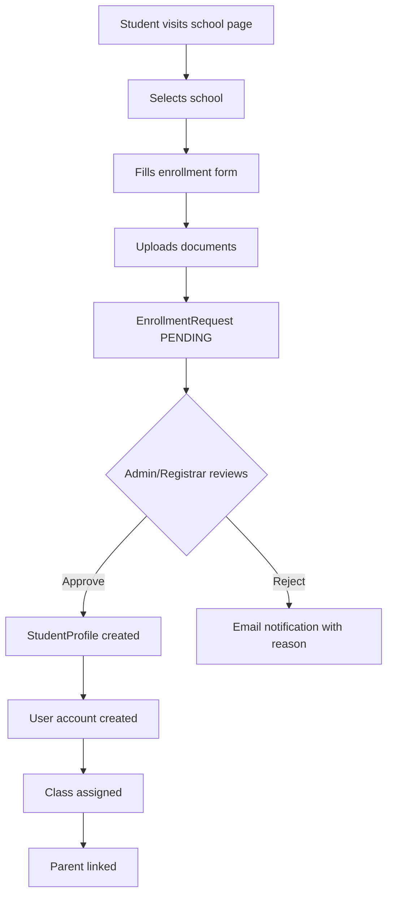
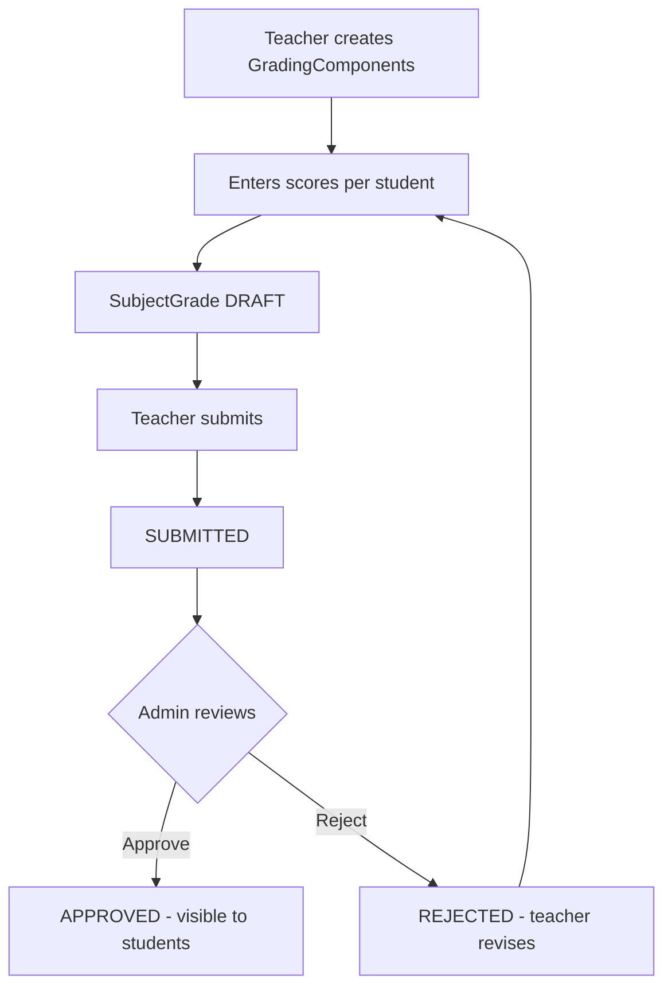
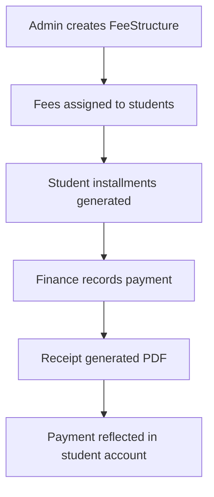
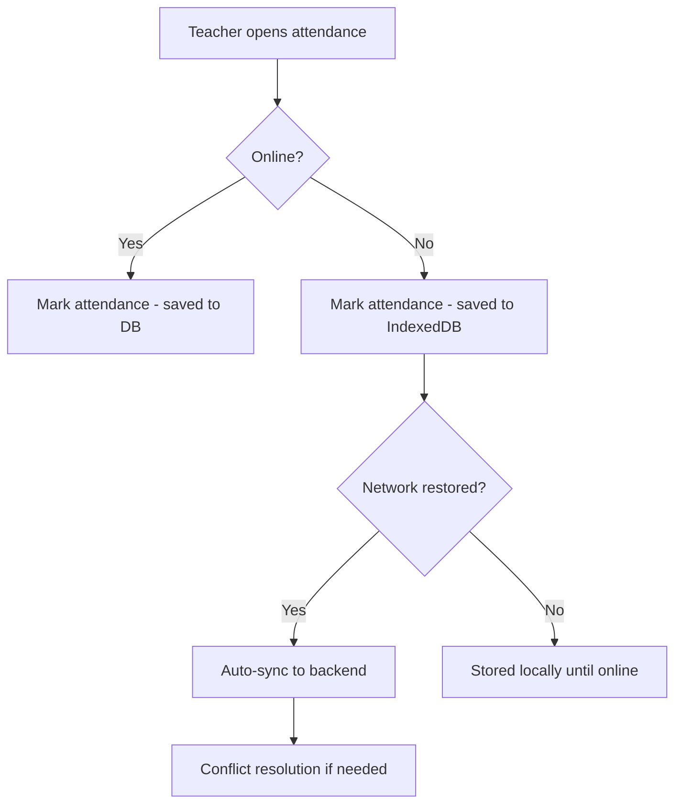
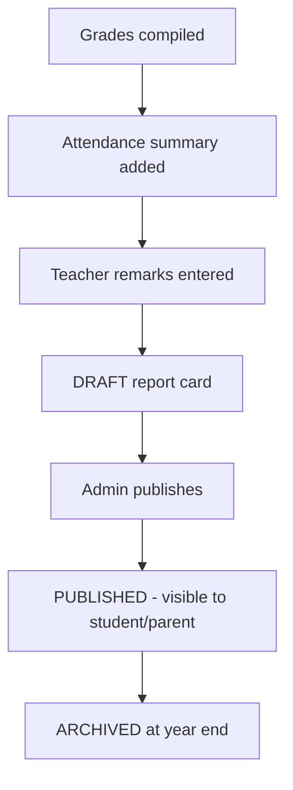
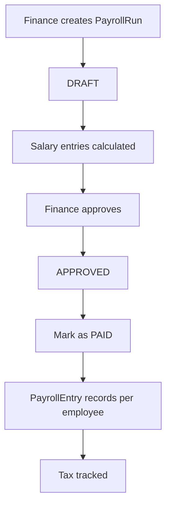

# User Flows — YeneSchool

> Purpose: End-to-end user workflows for key operations.

---

## 1. Enrollment Flow

## 2. Grading Flow

## 3. Fee Payment Flow

## 4. Attendance Flow

## 5. Report Card Flow

## 6. Payroll Flow

## Related Documents

- `docs/BUSINESS_RULES.md` — Detailed business rules for each flow
- `docs/FEATURES/*/README.md` — Feature-specific workflows
